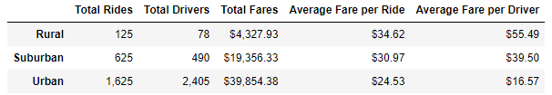
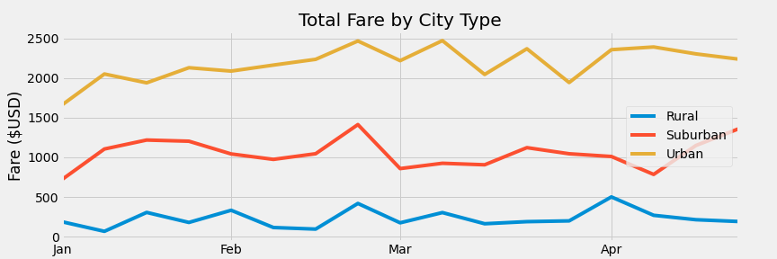

# PyBer Analysis

## Overview

The purpose of this analysis was to look for differences in PyBer ride sharing data between different types of cities. This information is useful to PyBer executives looking to adjust their business model and maximize revenue.

## Results

**Figure 1. Ride Share Data by City Type**

**Figure 2. Total Fares by City Type**

